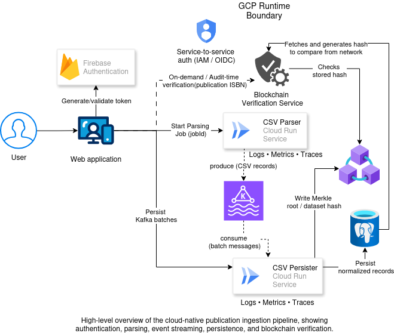

# 📚 Publication Management System

A **cloud-native Java publication processing platform** built around CSV ingestion, secure persistence, event streaming, and blockchain anchoring.

> This project started as a Java CSV coding challenge and evolved into a **production-style system** demonstrating modern backend architecture, cloud deployment, and secure configuration practices.

---

## 🚀 Overview

The system ingests **large CSV datasets** (authors, books, magazines), processes them in batches, persists them to a database, publishes events, and optionally anchors content hashes on blockchain.

The same Java codebase runs **locally, in Docker, and on Google Cloud Run** without modification.

Take a look at the adr documents [here](./docs/adr/ADR-Index.md)

---

## Architecture Overview

The platform is designed as a cloud-native, event-driven ingestion system with built-in data integrity verification using blockchain.

At a high level:
- Users authenticate via Firebase Authentication
- A web application initiates CSV parsing jobs
- Parsing and persistence are decoupled using Kafka
- Normalized data is stored in PostgreSQL
- A cryptographic dataset hash is written to Ethereum to guarantee immutability
- Verification can be performed independently by recomputing and comparing hashes

### Diagram Source

The original diagram file (`.drawio`) is in the `docs/architecture/` folder. You can open it in **app.diagrams.net** to explore or modify it.

| Component   | Tech             |
| ----------- |------------------|
| Auth        | Firebase         |
| Compute     | GCP Cloud Run    |
| Messaging   | Confluent Kafka  |
| Persistence | PostgreSQL       |
| Blockchain  | Ethereum Sepolia |

For detailed architecture discussion:
- Designing a Hybrid GCP Architecture — Medium Part 1 :contentReference[oaicite:3]{index=3}
- Event-Driven Ingestion with Kafka — Medium Part 2 :contentReference[oaicite:4]{index=4}
- Making Data Immutable with Blockchain — Medium Part 3 :contentReference[oaicite:5]{index=5}
